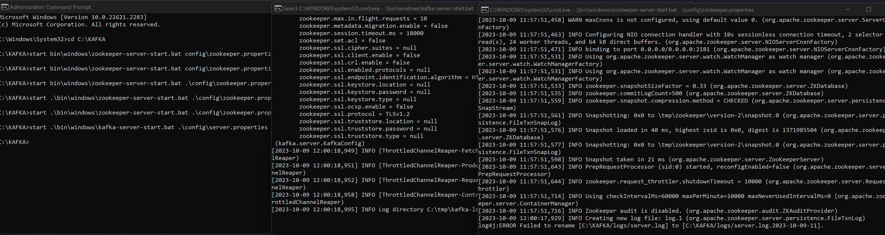
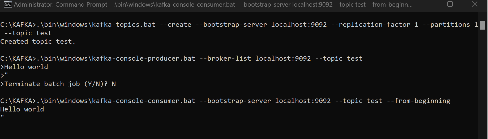
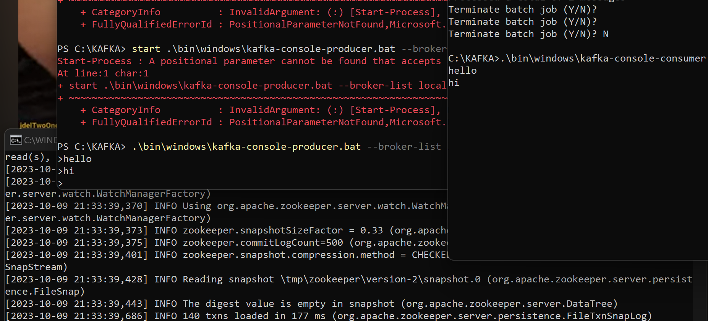
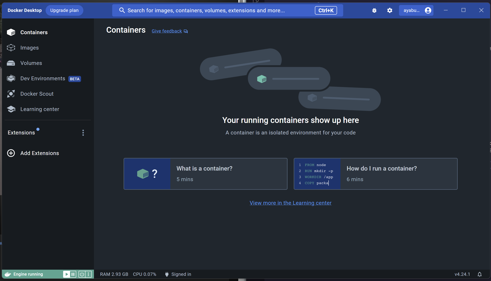
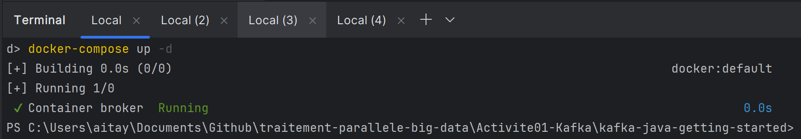
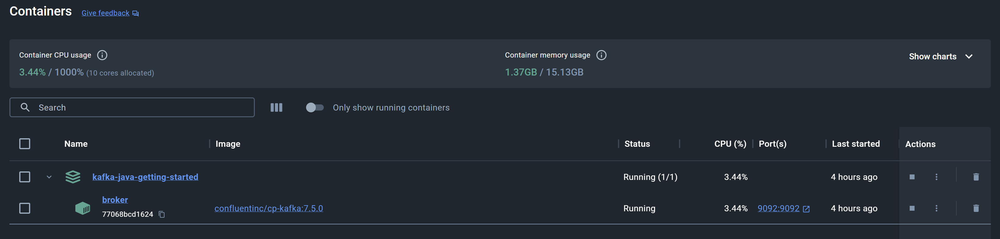
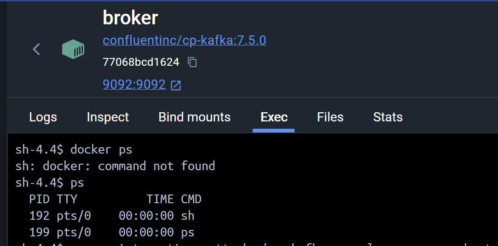
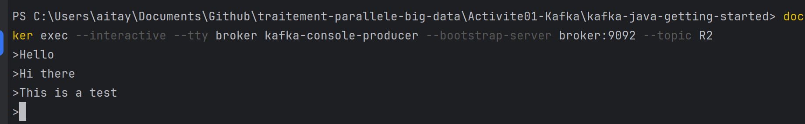
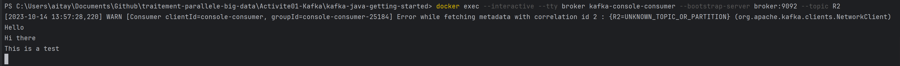
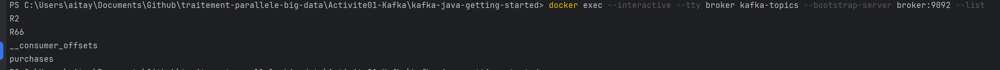

# Activité pratique N°1

## Partie 1 : Kafka

### 1.1 Installation de Kafka
Sur le site officiel de Kafka, on peut télécharger la dernière version de Kafka. Pour ce TP, nous avons utilisé la version 2.12-2.3.0. Après avoir téléchargé l'archive, il faut la décompresser et se placer dans le dossier créé. 

### 1.2 Lancement de Kafka et Zookeeper
Il faut lancer le serveur Zookeeper et le serveur Kafka. Pour cela, il faut lancer les commandes suivantes dans deux terminaux différents :

```bash
start .\bin\windows\zookeeper-server-start.bat .\config\zookeeper.properties
```

```bash
start .\bin\windows\kafka-server-start.bat .\config\server.properties
```



### 1.3 Test de Kafka
Pour tester Kafka, il faut créer un topic et envoyer des messages. Pour créer un topic, il faut lancer la commande suivante :

```bash
start .\bin\windows\kafka-topics.bat --create --bootstrap-server localhost:9092 --replication-factor 1 --partitions 1 --topic test
```

Pour envoyer des messages, il faut lancer la commande suivante :

```bash
start .\bin\windows\kafka-console-producer.bat --broker-list localhost:9092 --topic test
```
Pour saisir un message, il faut appuyer sur la touche Entrée. Puis pour quitter, il faut taper Ctrl+C.


Pour lire les messages, il faut lancer la commande suivante :

```bash
.\bin\windows\kafka-console-consumer.bat --bootstrap-server localhost:9092 --topic test --from-beginning
```







## Patie 2 : Docker 

### 2.1 Installation des composants
Pour installer Docker, il faut suivre les instructions du site officiel de Docker. Pour ce TP, nous avons utilisé la version Docker Desktop 4.24.1  (Windows 10 Home).




### 2.2 Création d'un environnnment 

Pour ceci, on utilisera la documentation **Confluent** : https://developer.confluent.io/quickstart/kafka-docker/ . 

Voici le fichier [`docker-compose.yml`](./kafka-java-getting-started/docker-compose.yml) utilisé : 

```yml
---
version: '3'
services:
  broker:
    image: confluentinc/cp-kafka:7.5.0
    container_name: broker
    ports:
      - "9092:9092"
    environment:
      KAFKA_BROKER_ID: 1
      KAFKA_LISTENER_SECURITY_PROTOCOL_MAP: CONTROLLER:PLAINTEXT,PLAINTEXT:PLAINTEXT,PLAINTEXT_HOST:PLAINTEXT
      KAFKA_ADVERTISED_LISTENERS: PLAINTEXT://broker:29092,PLAINTEXT_HOST://localhost:9092
      KAFKA_OFFSETS_TOPIC_REPLICATION_FACTOR: 1
      KAFKA_GROUP_INITIAL_REBALANCE_DELAY_MS: 0
      KAFKA_TRANSACTION_STATE_LOG_MIN_ISR: 1
      KAFKA_TRANSACTION_STATE_LOG_REPLICATION_FACTOR: 1
      KAFKA_PROCESS_ROLES: broker,controller
      KAFKA_NODE_ID: 1
      KAFKA_CONTROLLER_QUORUM_VOTERS: 1@broker:29093
      KAFKA_LISTENERS: PLAINTEXT://broker:29092,CONTROLLER://broker:29093,PLAINTEXT_HOST://0.0.0.0:9092
      KAFKA_INTER_BROKER_LISTENER_NAME: PLAINTEXT
      KAFKA_CONTROLLER_LISTENER_NAMES: CONTROLLER
      KAFKA_LOG_DIRS: /tmp/kraft-combined-logs
      CLUSTER_ID: MkU3OEVBNTcwNTJENDM2Qk
```

Pour compiler et démarrer l'environnement :

```bash
docker-compose up -d
```



Ce fichier génère le conteneur suivant :





Maintenant pour tester la communication on utilise les commandes suivantes :

```bash
docker exec --interactive --tty broker kafka-console-consumer --bootstrap-server broker:9092 --topic R2

docker exec --interactive --tty broker kafka-console-producer --bootstrap-server broker:9092 --topic R2

docker exec --interactive --tty broker kafka-console-consumer --bootstrap-server broker:9092 --topic R66 --property print.key=true --property print.value=true --property key.deserializer=org.apache.kafka.common.serialization.StringDeserializer --property value.deserializer=org.apache.kafka.common.serialization.LongDeserializer

docker exec --interactive --tty broker kafka-topics --bootstrap-server broker:9092 --list
```

Exécutées séparemment dans 4 terminaux.

- Envoi de messages de test



- Récepzion des messages de test



- Liste des topics




## Partie 3 : Spring cloud 
### 3.1 Initialisation du projet 
