# Activité pratique N°2 : Architectures Micro-services avec Spring cloud

## Sommaire
- [x] [Première partie : (Customer-Service, Inventory-Service, Spring Cloud Gateway, Eureka Discovery)](#première-partie--customer-service-inventory-service-spring-cloud-gateway-eureka-discovery)
- [x] [Deuxième Partie : Billing Service avec Open Feign Rest Client](#deuxième-partie--billing-service-avec-open-feign-rest-client)
- [x] [Troisième Partie : Client Angular](#troisième-partie--client-angular)

## Première partie : (Customer-Service, Inventory-Service, Spring Cloud Gateway, Eureka Discovery)

### 1. Initialisation du projet

En utilisant l'outil [Spring Initializr](https://start.spring.io/), on a généré un projet Spring Boot avec les dépendances suivantes :
- Lombok
- DevTools
- Spring Web
- Spring Data JPA
- h2 Database
- Euraka Discovery
- Spring Boot Actuator


### 2. Customer Microservice

On crée les composants suivants :   
- Customer Entity [Customer.java](customer-service/src/main/java/com/example/customerservice/entities/Customer.java)
- Customer Repository [CustomerRepository.java](customer-service/src/main/java/com/example/customerservice/repositories/CustomerRepository.java)

Dans le fichier [application.properties](customer-service/src/main/resources/application.properties), on a configuré le port et le nom de l'application :
```properties
server.port=8080
spring.application.name=cust-service
spring.datasource.url=jdbc:h2:mem:custdb
spring.datasource.username=sa
spring.datasource.password=123
spring.cloud.discovery.enabled=false
management.endpoints.web.exposure.include=*
```

Puis dans le fichier [CustomerServiceApplication.java](customer-service/src/main/java/com/example/customerservice/CustomerServiceApplication.java), on ajoute quelques données de test .

```java
@Bean
CommandLineRunner start(CustomerRepository customerRepository) {
	return args -> {
		customerRepository.save(new Customer(null, "Aya", "aya@aya.com"));
		customerRepository.save(new Customer(null, "Youssef", "youssef@ysef.com"));
    	customerRepository.save(new Customer(null, "Mohamed", "med@med.com"));
		customerRepository.findAll().forEach(System.out::println);
	};
}
```

On lance l'application et on teste :
- localhost:8080/actuator
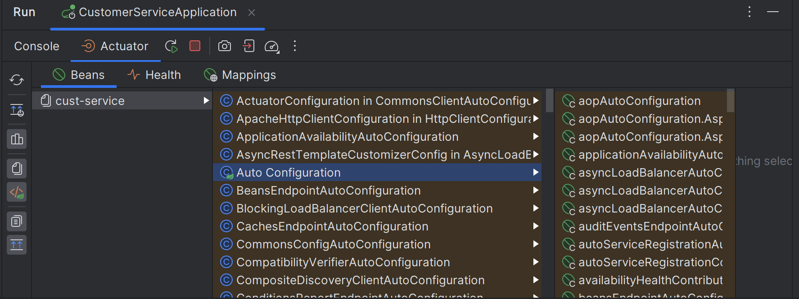

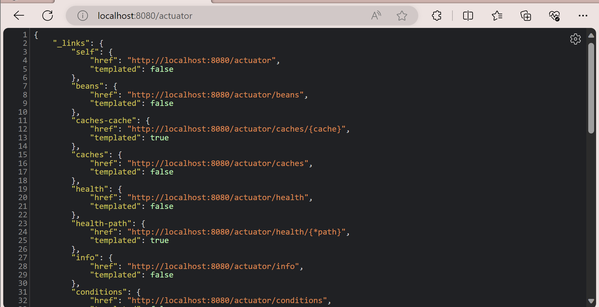

- localhost:8080/customers
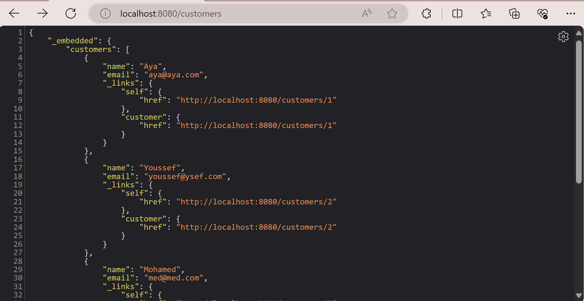

### 3. Inventory Microservice

De même façon, on crée les composants suivants :
- Product Entity [Product.java](inventory-service/src/main/java/com/example/inventoryservice/entities/Product.java)
- Product Repository [ProductRepository.java](inventory-service/src/main/java/com/example/inventoryservice/repositories/ProductRepository.java)

Dans le fichier [application.properties](inventory-service/src/main/resources/application.properties), on a configuré le port et le nom de l'application :

```properties
server.port=8081
spring.application.name=prod-service
spring.datasource.url=jdbc:h2:mem:proddb
spring.datasource.username=sa
spring.datasource.password=123
spring.cloud.discovery.enabled=false

management.endpoints.web.exposure.include=*
```

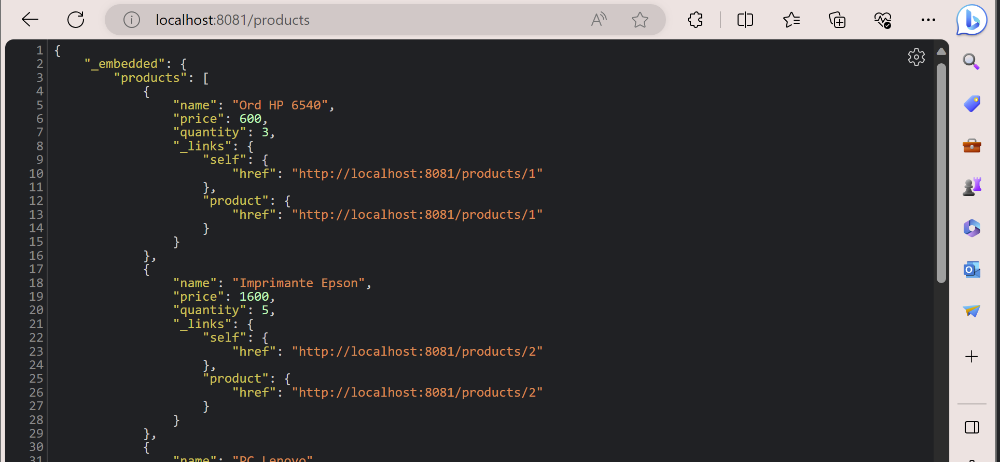

### 4. Spring Cloud Gateway

On crée un nouveau projet Spring Boot avec les dépendances suivantes :
- Spring Cloud Gateway
- Eureka Discovery Client
- Spring Boot Actuator

Dans le fichier [application.properties](gateway-service/src/main/resources/application.properties), on a configuré le port et le nom de l'application :

```properties
server.port=8080
spring.application.name=gateway-service
spring.cloud.discovery.enabled=false
```

Puis dans un fichier [application.yml](gateway-service/src/main/resources/application.yml), on a configuré le Spring Cloud Gateway :

```yml
spring:
  cloud:
    gateway:
      routes:
        - id: customer-service
          uri: http://localhost:8081
          predicates:
            - Path=/customers/**
          filters:
            - StripPrefix=1
        - id: product-service
          uri: http://localhost:8082
          predicates:
            - Path=/products/**
          filters:
            - StripPrefix=1
```

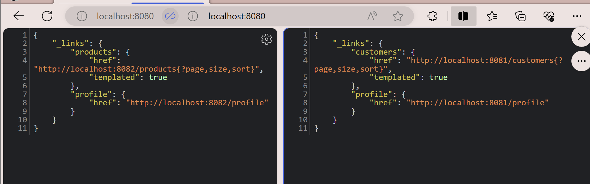

Puis dans [`GatewayApplication.java`](gateway-service/src/main/java/com/example/gatewayservice/GatewayApplication.java), on ajoute la méthode suivante :

```java
@Bean
	RouteLocator routeLocator(RouteLocatorBuilder builder){
		return builder.routes()
				.route(r->r.path("/customers/**").uri("http://localhost:8081"))
				.route(r->r.path("/products/**").uri("http://localhost:8082"))
				.build();

    }
```

On peut désormais accéder à Customer Service et Inventory Service via le Gateway Service :
- localhost:8080/customers
- localhost:8080/products

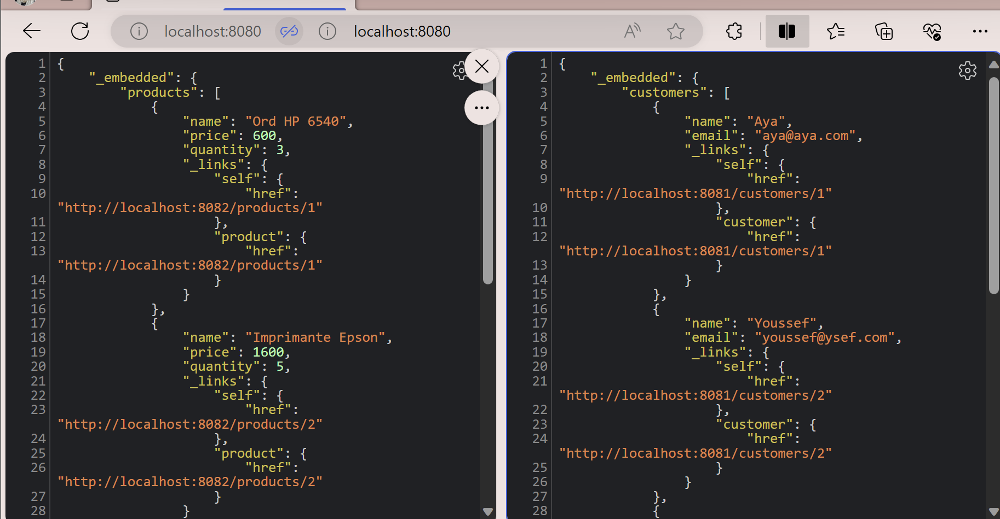

### 5. Eureka Discovery

On crée un nouveau projet Spring Boot **eureka-discovery** avec les dépendances suivantes :
- Eureka Discovery Server

Dans [`EurekaDiscoveryApplication.java`](eureka-discovery/src/main/java/com/example/eurekadiscovery/EurekaDiscoveryApplication.java), on ajoute l'annotation `@EnableEurekaServer` .

Puis dans le fichier [application.properties](eureka-discovery/src/main/resources/application.properties), on a configuré le port et le nom de l'application :

```properties
server.port=8761
eureka.client.fetch-registry=false
eureka.client.register-with-eureka=false
```

On lance et on accède à localhost:8761 :

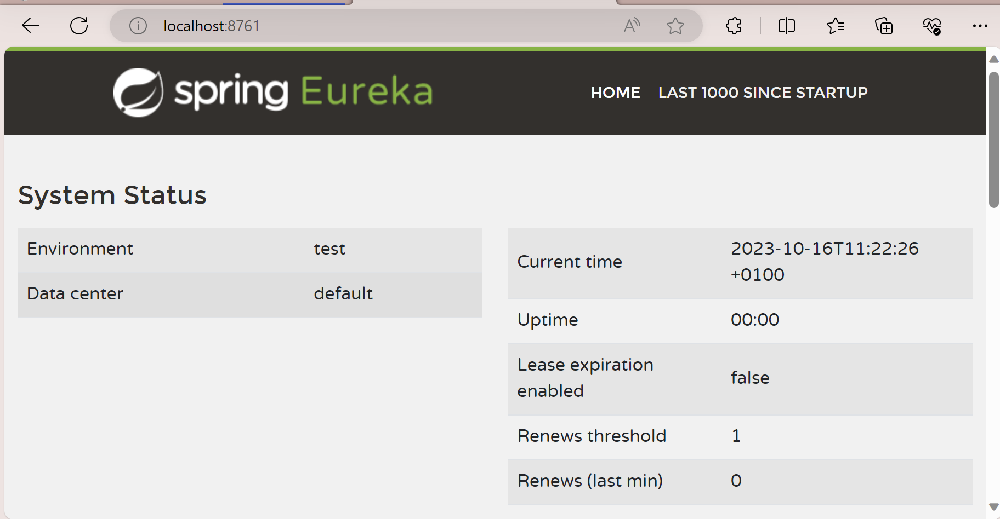

Pour les autres microservices, on change `spring.cloud.discovery.enable=true`
Les microservices s'affichent avec leur ID

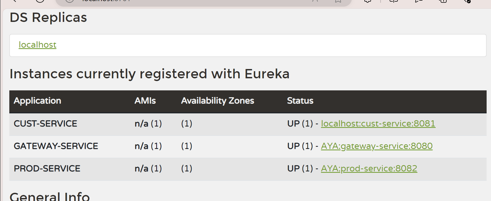

On peut désormais utiliser les id pour identifier les microservices 

```java
        .route(r->r.path("/customers/**").uri("lb://CUST-SERVICE"))
        .route(r->r.path("/products/**").uri("lb://PROD-SERVICE"))
```

On change la méthode de cofiguration des routes dans  [`GatewayApplication.java`](gateway-service/src/main/java/com/example/gatewayservice/GatewayApplication.java) avec ne métode plus dynamique : 

````java
@Bean
DiscoveryClientRouteDefinitionLocator definitionLocator(ReactiveDiscoveryClient rdc, DiscoveryLocatorProperties properties){
    return new DiscoveryClientRouteDefinitionLocator(rdc,properties);
}
````
On n'a plus besoin de définir les routes manuellement. 
Pour accéder aux micros- services : 
- localhost:8080/{NOM_SERVICE}/path

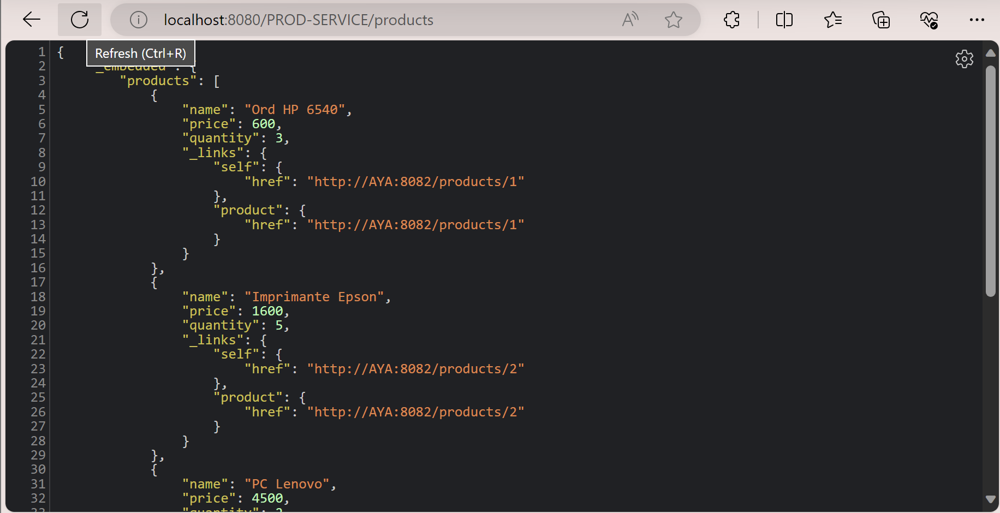

----
NOTE : 
Il faut renommer le fichier `application.yml` pour qu'il ne soit pas pris en compte par Spring Cloud Gateway.

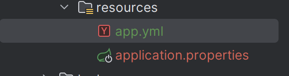
----

## Deuxième Partie : Billing Service avec Open Feign Rest Client

On redemarre les services dans l'ordre suivant :
- eureka-discovery (port 8761)
- customer-service (port 8081)
- inventory-service (port 8082)
- gateway-service (port 8080)

### 1. Billing Service

On crée un nouveau projet Spring Boot **billing-service** avec les dépendances suivantes :
- Eureka Discovery Client
- Spring Web
- Spring Data JPA
- Spring Cloud OpenFeign
- H2 Database
- Rest Repositories
- Spring HATEOAS

On crée les entités suivantes :
- Bill Entity [Bill.java](billing-service/src/main/java/com/example/billingservice/entities/Bill.java)
- Product Item Entity [ProductItem.java](billing-service/src/main/java/com/example/billingservice/entities/ProductItem.java)

Puis les models suivants :
- Customer Model [Customer.java](billing-service/src/main/java/com/example/billingservice/model/Customer.java)
- Product Model [Product.java](billing-service/src/main/java/com/example/billingservice/model/Product.java)

On crée les repositories suivants :
- Bill Repository [BillRepository.java](billing-service/src/main/java/com/example/billingservice/repositories/BillRepository.java)
- Product Item Repository [ProductItemRepository.java](billing-service/src/main/java/com/example/billingservice/repositories/ProductItemRepository.java)

On crée les Rest Clients suivants :
- Customer Rest Client [CustomerRestClient.java](billing-service/src/main/java/com/example/billingservice/feign/CustomerRestClient.java)
- Inventory Rest Client [InventoryRestClient.java](billing-service/src/main/java/com/example/billingservice/feign/InventoryRestClient.java)

Dans [`BillingServiceApplication.java`](billing-service/src/main/java/com/example/billingservice/BillingServiceApplication.java), on ajoute l'annotation `@EnableFeignClients` .
Puis on ajoute la méthode suivante :

```java
@Bean
	CommandLineRunner start(BillRepository billRepository,
							ProductItemRepository productItemRepository,
							CustomerRestClient customerRestClient,
							ProductItemRestClient productItemRestClient) {
		return args -> {
			Customer c1 = customerRestClient.getCustomerById(1L);
			System.out.println("***********************");
			System.out.println("ID = " + c1.getId());
			System.out.println("Name = " + c1.getName());
			System.out.println("Email = " + c1.getEmail());
			System.out.println("***********************");
		};
	}
```

Une dernière configuration à fair c'est dans le fichier [application.properties](billing-service/src/main/resources/application.properties) :

```properties
spring.h2.console.enabled=true
spring.datasource.url=jdbc:h2:mem:testdb
spring.datasource.driverClassName=org.h2.Driver
````

On reçoit les données du Customer Service :

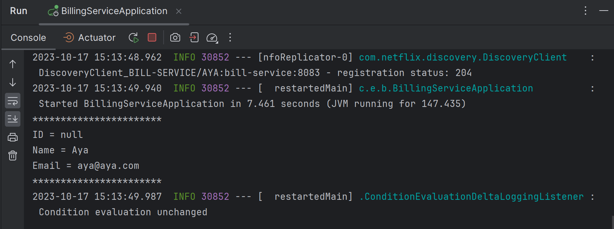

Pour exposer les ID des customers et des products, on ajoute dans CommandLineRunner du service CustomerService  :

```java
 	CommandLineRunner start(CustomerRepository customerRepository,
							RepositoryRestConfiguration restConfiguration) {
		restConfiguration.exposeIdsFor(Customer.class);
          ...
```

Même chose pour le service InventoryService :

```java
 	CommandLineRunner start(ProductRepository productRepository,
                            RepositoryRestConfiguration restConfiguration) {
        restConfiguration.exposeIdsFor(Product.class);
          ...
```

On reçoit les données du Customer Service :

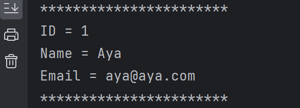

On peut enregistrer une facture avec les données du Customer Service :

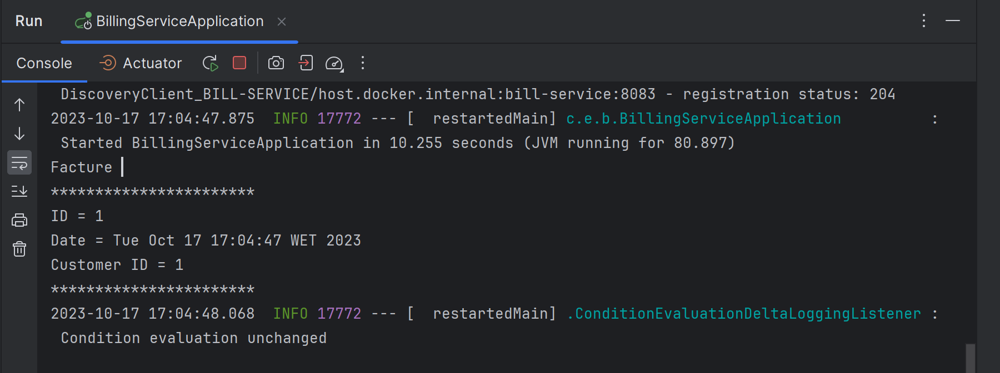


Pour pouvoir communiquer avec Billing Service, on ajoute [`BillingRestConfig.java`](billing-service/src/main/java/com/example/billingservice/config/BillingRestConfig.java) dans le service CustomerService.

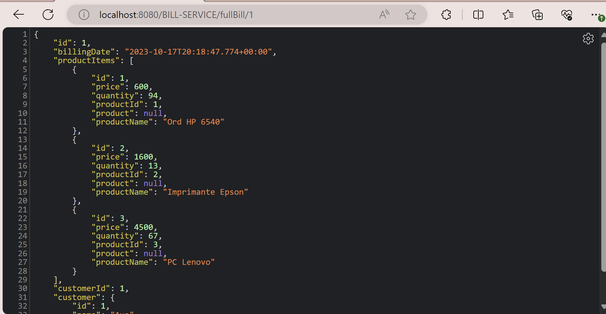


## Troisième Partie : Client Angular

On crée un nouveau projet Angular.

Puis on installe les dépendances suivantes :
- Bootstrap

```bash
npm install bootstrap
```

On ajoute le composant ProductsComponent :

```bash
ng g c products
```

On vérifie que les services sont bien lancés :

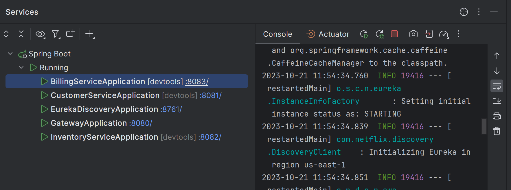

Puis dans [`products.component.ts`](ecom-web-app/src/app/products/products.component.ts), on ajoute la méthode suivante :

```typescript
  ngOnInit(): void {
    this.http.get('http://localhost:8080/PROD-SERVICE/products').subscribe({
        next : (data) => {
            this.products = data;
        },
        error : (error) => {
            console.log(error);
        }
    });
}
```

_ Gateway cors filter : dans [`application.yml`](gateway/src/main/resources/application.yml) on ajoute les lignes suivantes : 

```yml
spring:
  cloud:
    gateway:
      globalcors:
        corsConfigurations:
            '[/**]':
                allowedOrigins: "*"
                allowedMethods:
                - GET
                - POST
                - PUT
                - DELETE
                allowedHeaders:
                - "*"
                allowCredentials: true
```
