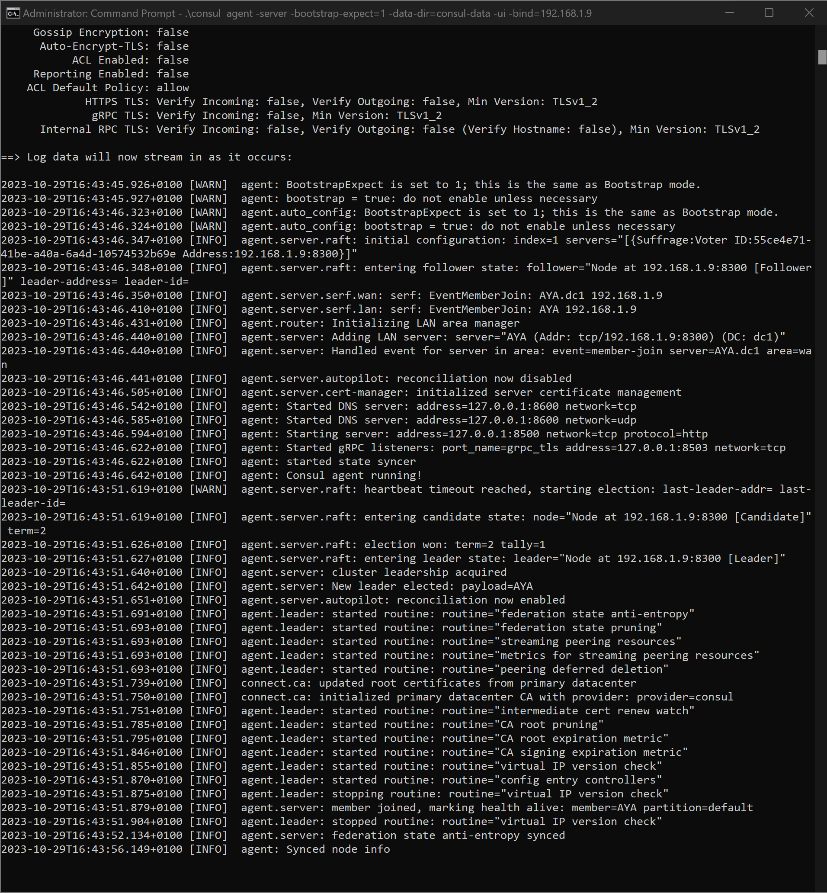
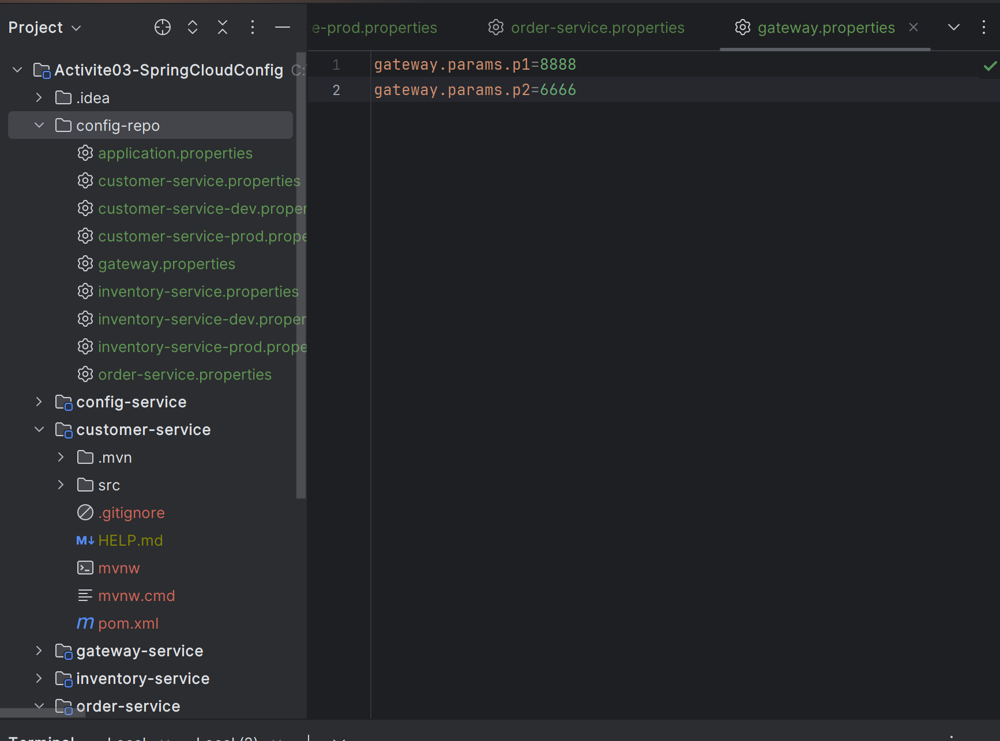
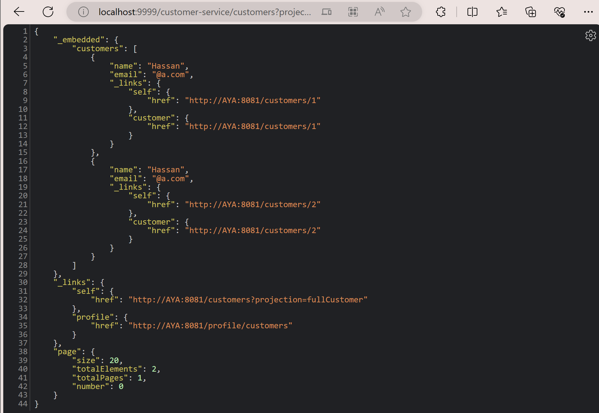

# Micro Service architecture

> Project Configuration
> 
> Version : Java 17
> Maven : 2.7.17

## Services and dependencies

| Service           | Dependencies                                                                                             |
|-------------------|----------------------------------------------------------------------------------------------------------|
| Config-service    | Config server - Actuator - Consul Discovery                                                              |
| Customer-service  | Config client - Actuator - Consul Discovery- JPA-Web-H2-Lombok- Rest Repositories                        |
| Inventory-service | Config client - Actuator - Consul Discovery- JPA-Web-H2-Lombok- Rest Repositories                        |
| Order-service     | Config client - Actuator - Consul Discovery- JPA-Web-H2-Lombok- Rest Repositories - Open Feign - HATEOAS |
| Gateway-service   | Gateway - actuator - Consul Discovery                                                                    |

## Configuration application.properties

| Service          | applications.properties                                                                                                        |
|------------------|--------------------------------------------------------------------------------------------------------------------------------|
| config-server    | server-port 8888<br/>spring.application.name=config-service<br/>                                                               |
| customer-service | server.port=8081<br/>spring.application.name=customer-service <br/>spring.config.import=optional:configserver:http://localhost:8888 |
|                  |                                                                                                                                |
|                  |                                                                                                                                |
|                  |                                                                                                                                |


- on télecharge [Consul](https://www.consul.io/downloads)

cOMMANDE D'exécution de consul
```shell
.\consul agent -server -bootstrap-expect=1 -data-dir=consul-data -ui -bind='192.168.1.254'
```
Pour tester on accède à l'interface graphique de consul via l'url [http://localhost:8500/ui](http://localhost:8500/ui)



On crée un dossier config-repo 



On l'initialise avec git
```shell
git init
git add .
git commit -m "first commit"
```

On copie le lien du dossier config-repo et dans le fichier application.properties du config-server on ajoute la ligne suivante
```application.properties
spring.cloud.config.server.git.uri=file:///C://Users//aitay//Documents//Github//traitement-parallele-big-data//Activite03-SpringCloudConfig//config-repo
```

Dans ConfigServiceApplication.java on ajoute l'annotation @EnableConfigServer

```java
@EnableConfigServer // Enable Spring Cloud Config Server
public class ConfigServiceApplication {

    public static void main(String[] args) {
        SpringApplication.run(ConfigServiceApplication.class, args);
    }

}
```

On lance le serveur et on accède à l'url [http://localhost:8888/customer-service/default](http://localhost:8888/customer-service/default)

### Customer-service

[`CustomerController.java`](customer-service/src/main/java/com/example/customerservice/web/CustomerConfigTestConstroller.java)

```java
@RestController
@RefreshScope // Permet de rafraichir les valeurs des variables sans redémarrer le serveur
public class CustomerConfigTestConstroller {
    @Value("${global.params.p1}")
    private String p1;
    @Value("${global.params.p2}")
    private String p2;
    @Value("${customer.params.x}")
    private String x;
    @Value("${customer.params.y}")
    private String y;

    @GetMapping("/params")
    public Map<String, String> params() {
        return Map.of("p1", p1, "p2", p2, "x", x, "y", y);
    }


}
```

> Note : Pour changr les config 
> 1. Commiter les changements
> 2. Lancer un refresh sur le serveur config en appelant l'url [http://localhost:8888/actuator/refresh](http://localhost:8888/actuator/refresh)
> Vérifier qie management.endpoints.web.exposure.include=*
 existe dans le fichier application.properties du config-server ou de customer-service
>


**Important**
If the service can't interprete the config server url, add the following dependency to the service pom.xml
```xml
<dependency>
    <groupId>org.springframework.cloud</groupId>
    <artifactId>spring-cloud-starter-bootstrap</artifactId>
</dependency>
```

Pour faire la projection, on crée une interface CustomerProjection.java
```java
@Projection(name = "fullCustomer", types = Customer.class)
public interface CustomerProjection {
    public Long getId();
    public String getName();
    public String getEmail();
}
```

Pour tester :
[http://localhost:9999/customer-service/customers?projection=fullCustomer](http://localhost:9999/customer-service/customers?projection=fullCustomer)



### Order-service

Order a besoin de communiquer avec les autres services.
On a besoin de Open Feign et HATEOAS

Dans le pom.xml on ajoute la dépendance suivante
```xml
<dependency>
    <groupId>org.springframework.cloud</groupId>
    <artifactId>spring-cloud-starter-openfeign</artifactId>
    <version>3.0.3</version>
</dependency>
<dependency>
    <groupId>org.springframework.boot</groupId>
    <artifactId>spring-boot-starter-hateoas</artifactId>
    <version>2.5.5</version>
</dependency>
```

Dans le fichier application.properties on ajoute la ligne suivante
```properties
server.port=8083
spring.application.name=order-service
spring.config.import=optional:configserver:http://localhost:8888
```

Pour tester :
[http://localhost:9999/order-service/orders](http://localhost:9999/order-service/orders)


